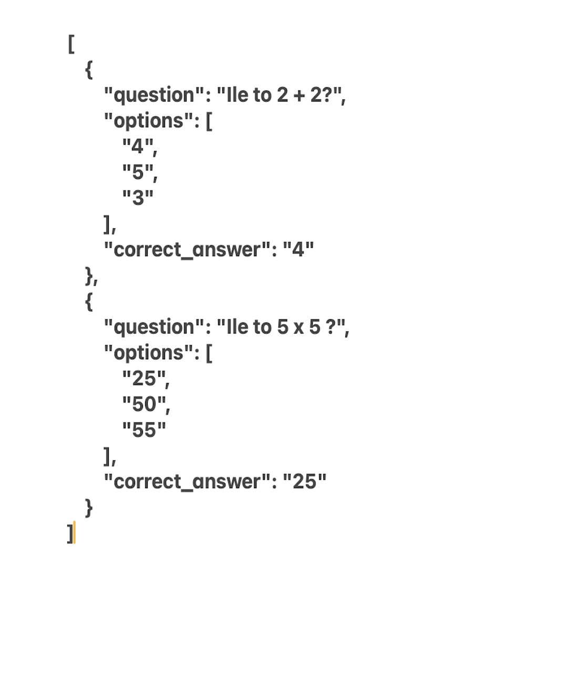

# QuizForm
A desktop application for creating questions and answers in JSON format, designed for the QuickQuiz app. Developed using Python, CSS and PyQt5.

<table>
  <tr>
    <td></td>
    <td></td>
    <td></td>
    <td></td>
    <td></td>
  </tr>
</table>

## Author
### Paulina Zabielska 
Github: [https://github.com/zpaulinz]
