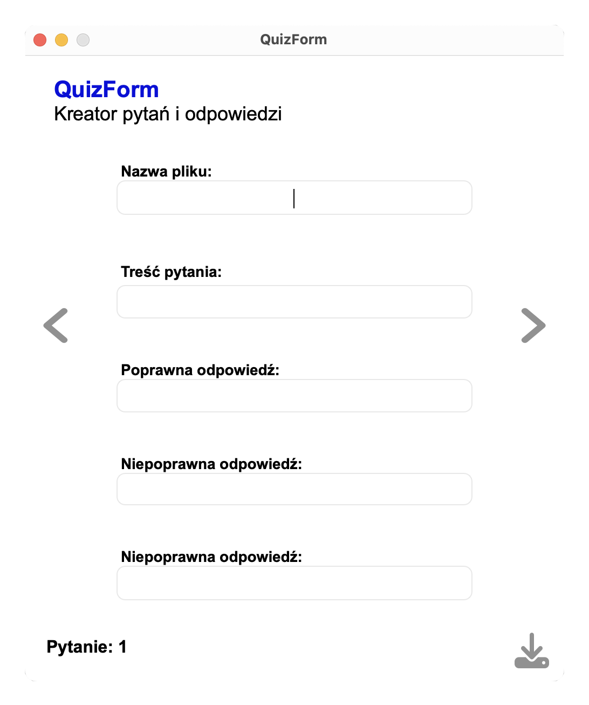

# QuizForm
A desktop application for creating questions and answers in JSON format, designed for the QuickQuiz app. Developed using Python, CSS and PyQt5. 

## Example of the JSON output:
```json
{
  "questions": [
    {
      "question": "Ile to 2 + 2?",
      "options": [
        "4",
        "5",
        "3"
      ],
      "correct_answer": "4",
    },
    {
      "question": "Ile to 5 x 5?",
      "options": [
        "25",
        "50",
        "55"
      ],
      "correct_answer": "25"
    }
  ]
}
```

## Screenshots
<table>
  <tr>
    <td></td>
    <td></td>
    <td></td>
    <td></td>
  </tr>
</table>

## Author
### Paulina Zabielska 
Github: [https://github.com/zpaulinz]
